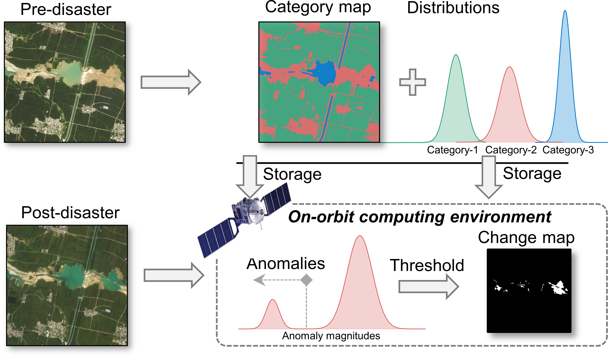
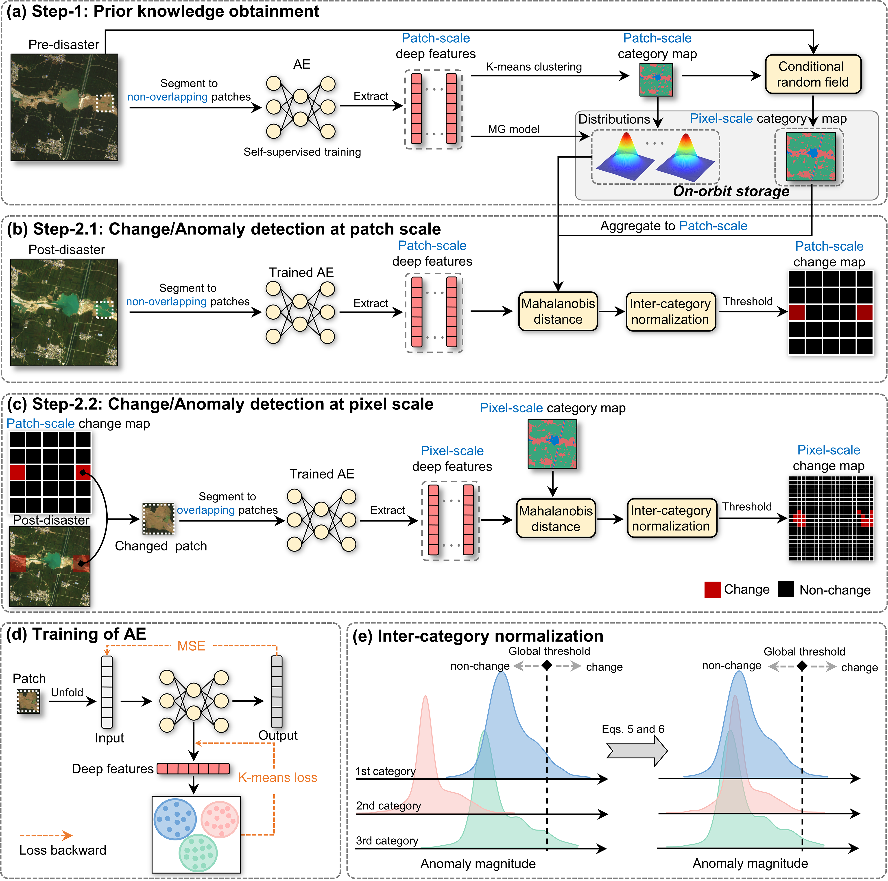
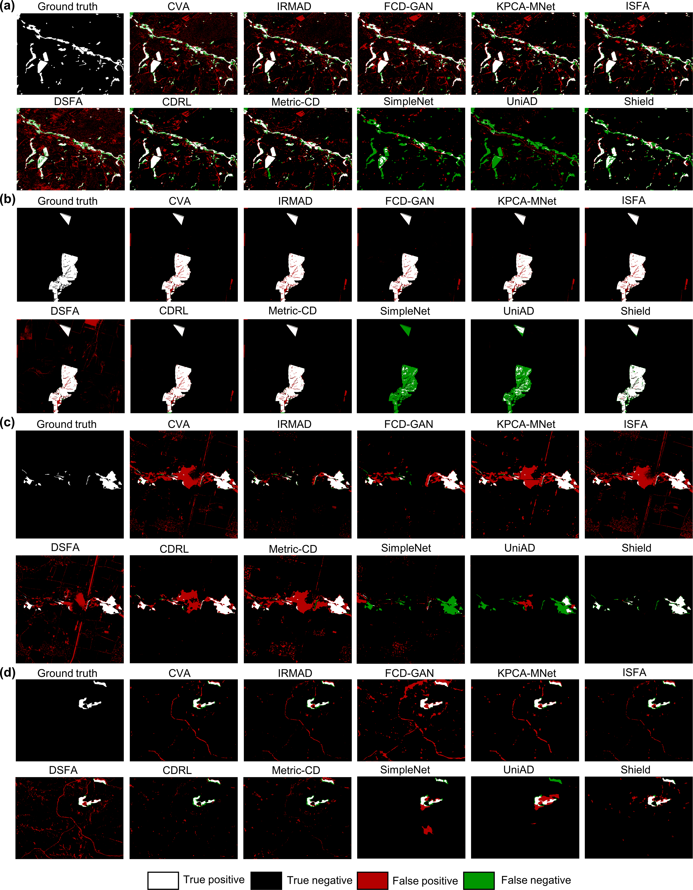
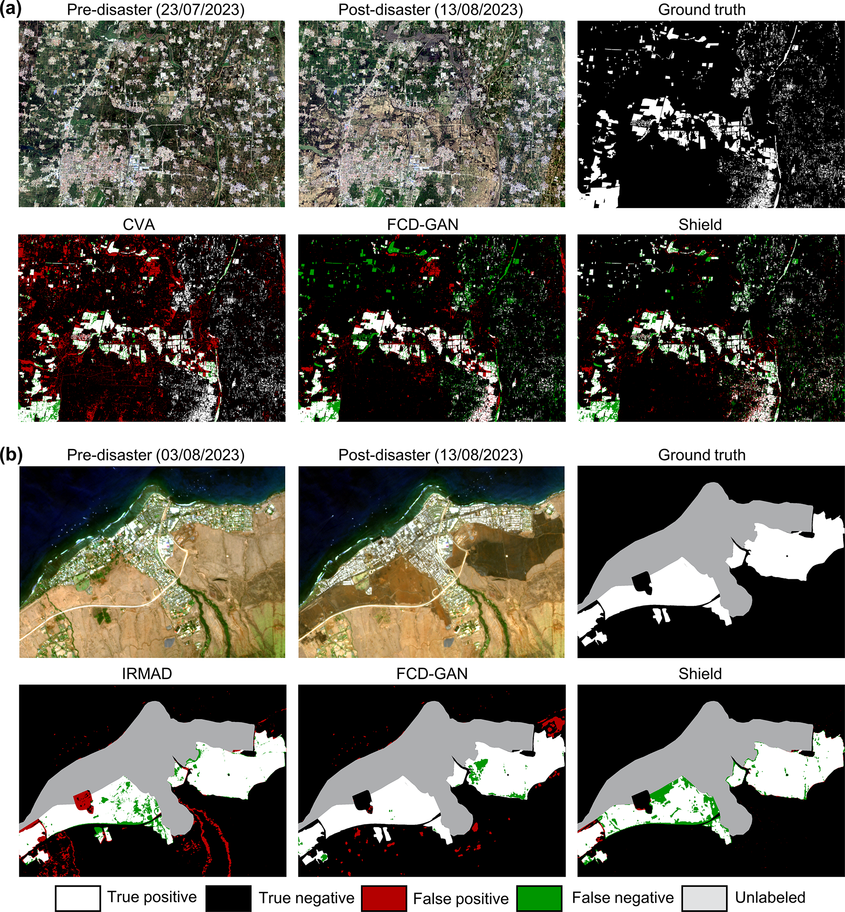

## Unsupervised detection of disaster-affected areas by combining the strengths of change detection and anomaly detection: target for on-orbit application.

[[Paper]](https://spj.science.org/doi/abs/10.34133/remotesensing.0929)



## Introduction
<p style="text-align: justify;">
Timely and accurate monitoring of abrupt natural disasters, such as floods, landslides, and wildfires, is critical for protecting lives and property. On-orbit satellite image change detection offers near-real-time disaster insights, yet existing methods, designed for ground-based tasks, overlook the resource constraints of on-orbit computing environments. To fill this study gap, we propose a novel change detection method, <b>Single-temporal HIgh-spatial rEsoLution image unsupervised change Detection (Shield)</b>, tailored to the constraints of on-orbit computing environments. Shield integrates the capabilities of change detection models that can identify various disaster events, with the efficiency of anomaly detection methods, which demand fewer computational resources and only require a single post-disaster image along with prior knowledge as input. First, Shield generates lightweight prior knowledge from pre-disaster imagery to establish connections between the changes and anomalies. Then, Shield employs a two-step localization strategy to progressively identify change patches and pixels in post-disaster imagery to provide disaster-affected areas of interest. 
</p>

## Overview of Shield


Flowchart of Shield, which includes two steps: prior knowledge obtainment (a) and change/anomaly detection at patch (b) and pixel scales (c). (d) is the detailed self-supervised training process of the autoencoder neural network (AE), and (e) is the illustration of the inter-category normalization. MG model denotes the multivariate Gaussian model.

## Requirements
Shield requires the installation of [joblib](https://joblib.readthedocs.io/en/stable/), [pydensecrf](https://github.com/lucasb-eyer/pydensecrf). For version dependency information, refer to [requirements.txt](requirements.txt).

## Getting Started

`python main.py configs/flood.yaml`

If you want to train your own model and perform detection, please modify the mode parameter in [config](configs/flood.yaml) to `train-detect`.
The [experiments](experiments) provides visualizations of trained checkpoints and intermediate results.


## Main results




## Citation
If you use the Shield codes, please cite our paper:
```bibtex
@article{tang2026shield,
  title = {Unsupervised Detection of Disaster-Affected Areas by Combining the Strengths of Change Detection and Anomaly Detection: Target for On-Orbit Application},
  journal = {Journal of Remote Sensing},
  author = {Tang, Kai and Wang, Qiao and Xu, Fei and Gu, Zhuoning and Chen, Xuehong and Chen, Jin},
  year = {2026},
  volume = {6},
  ISSN = {2694-1589},
  DOI = {10.34133/remotesensing.0929},
  pages = {0929}
}
```
